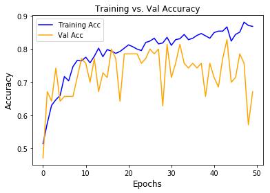
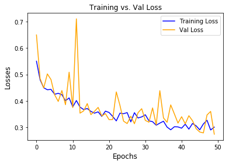
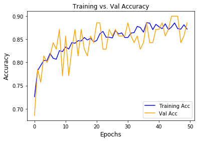
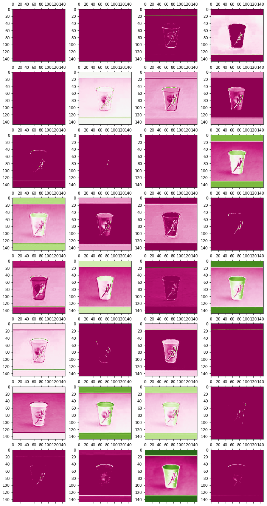
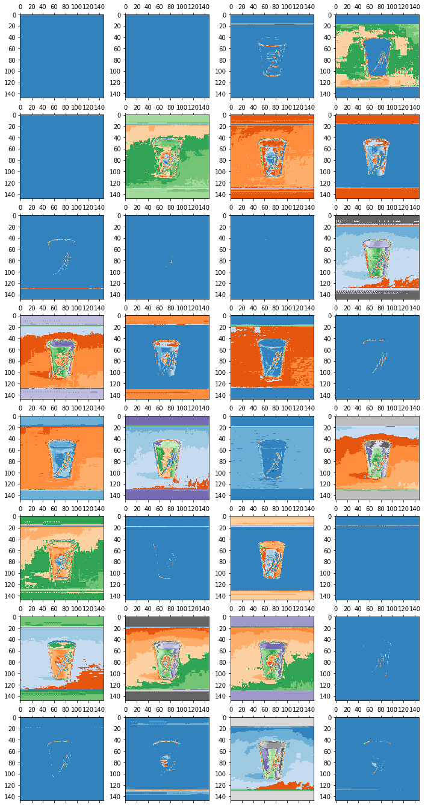

# Waste Classification Using Convolutional Neural Networks
#### By: Taylor Stanley

### Introduction

A look into the Waste Classification dataset provided by Kaggle (https://www.kaggle.com/techsash/waste-classification-data).
The purpose of this project was to build a predictive model that could accurately classify images into either Organic or 
Recyclable waste.

### Approach
My approach was to initially create a Multilayer Perceptron (MLP) and input the images as column vectors directly to establish
a baseline model.  Afterwards, I wanted to try my hand out at building my own Convolutional Neural Network (CNN) to see
if I could improve upon the initial results from my MLP model.  

### Summary
The project overall went very well, with my final CNN model reaching an accuracy of **~91%**.  These results were then compared
with pre-trained models to serve as benchmarks.  I chose three models: VGG16, VGG19, & Xception with each of them scoring
86%, 86%, and 91% respectively. 

## Sample Visualizations

### MLP Base Performance

### CNN Final Performance

### Image Slicing Visuals

